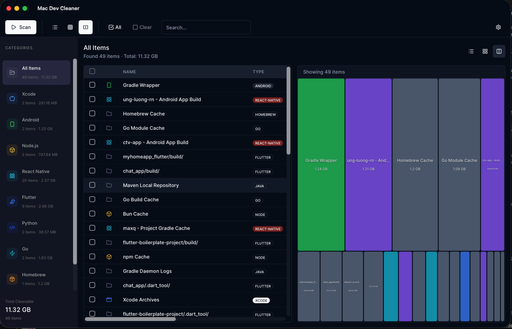

# Mac Dev Cleaner

> 🧹 Clean development artifacts on macOS - free up disk space fast!

[](https://golang.org/)
[](LICENSE)

**Available as both CLI and beautiful native GUI app!**

## Overview

Mac Dev Cleaner helps developers reclaim disk space by removing:

- **Xcode** - DerivedData, Archives, Caches
- **Android** - Gradle caches, SDK caches
- **Node.js** - node_modules, npm/yarn/pnpm/bun caches
- **Flutter/Dart** - .pub-cache, .dart_tool, build artifacts
- **Python** - pip/poetry/uv caches, virtualenvs, __pycache__
- **Rust** - Cargo registry, git caches, target directories
- **Go** - build cache, module cache
- **Homebrew** - download caches
- **Docker** - unused images, containers, volumes, build cache
- **Java/Kotlin** - Maven .m2, Gradle caches, build directories

## Screenshots

### GUI App



**Features:**
- 🎨 **Beautiful Native Interface** - Modern dark mode UI built with Wails
- 📊 **Multiple Views** - Switch between List, Treemap, and Split view
- 🔍 **Smart Categorization** - Filter by development ecosystem (Xcode, Android, Node.js, etc.)
- 📈 **Visual Size Analysis** - Interactive treemap shows space usage at a glance
- ⚡ **Real-time Scan** - Fast parallel scanning with progress indicators
- 🎯 **Selective Cleaning** - Pick exactly what to delete with checkboxes
- 💾 **Safe Deletion** - Confirmation dialogs prevent accidents
- 🔄 **Auto-Update** - Check for new versions automatically

**Download DMG:**
- [Apple Silicon (M1/M2/M3)](https://github.com/thanhdevapp/mac-dev-cleaner-cli/releases/latest/download/mac-dev-cleaner-darwin-arm64.dmg)
- [Intel](https://github.com/thanhdevapp/mac-dev-cleaner-cli/releases/latest/download/mac-dev-cleaner-darwin-amd64.dmg)

## Installation

### GUI App (Recommended for Most Users)

Download and install the native app:
- [Apple Silicon DMG](https://github.com/thanhdevapp/mac-dev-cleaner-cli/releases/latest/download/mac-dev-cleaner-darwin-arm64.dmg)
- [Intel DMG](https://github.com/thanhdevapp/mac-dev-cleaner-cli/releases/latest/download/mac-dev-cleaner-darwin-amd64.dmg)

### CLI Tool

**Homebrew:**
```bash
brew tap thanhdevapp/tools
brew install dev-cleaner
```

**One-line installer:**
```bash
curl -fsSL https://raw.githubusercontent.com/thanhdevapp/mac-dev-cleaner-cli/dev-mvp/install.sh | bash
```

### More Options

See [INSTALL.md](INSTALL.md) for:
- Direct binary downloads (macOS ARM/Intel, Linux)
- Build from source instructions
- Advanced configuration
- Troubleshooting

### Quick Build from Source

```bash
git clone https://github.com/thanhdevapp/mac-dev-cleaner-cli.git
cd mac-dev-cleaner-cli
go build -o dev-cleaner ./cmd/dev-cleaner
sudo mv dev-cleaner /usr/local/bin/
```

## CLI Usage

### Scan for Cleanable Items

```bash
# Scan all categories
dev-cleaner scan

# Scan specific category
dev-cleaner scan --ios
dev-cleaner scan --android
dev-cleaner scan --node
dev-cleaner scan --flutter
dev-cleaner scan --python
dev-cleaner scan --rust
dev-cleaner scan --go
dev-cleaner scan --homebrew
dev-cleaner scan --docker
dev-cleaner scan --java
```

**Example Output:**
```
🔍 Scanning for development artifacts...
──────────────────────────────────────────────────

  [1] android      9.0 GB  Android System Images
  [2] xcode        7.4 GB  Xcode DerivedData
  [3] android      5.4 GB  Gradle Caches
  [4] xcode        3.9 GB  DerivedData/Runner-xxx
  [5] node         1.8 GB  npm Cache
  ...
──────────────────────────────────────────────────
Total: 14 items, 31.4 GB
```

### Clean Items

```bash
# Interactive clean (dry-run by default)
dev-cleaner clean

# Actually delete files
dev-cleaner clean --confirm

# Clean specific category
dev-cleaner clean --ios --confirm
```

### Safety Features

- ✅ **Dry-run by default** - preview before deleting
- ✅ **Confirmation required** - must type `yes` to delete
- ✅ **Path validation** - never touches system files
- ✅ **Logging** - all actions logged to `~/.dev-cleaner.log`

## Scanned Directories

### iOS/Xcode
- `~/Library/Developer/Xcode/DerivedData/`
- `~/Library/Developer/Xcode/Archives/`
- `~/Library/Caches/com.apple.dt.Xcode/`
- `~/Library/Developer/CoreSimulator/Caches/`
- `~/Library/Caches/CocoaPods/`

### Android
- `~/.gradle/caches/`
- `~/.gradle/wrapper/`
- `~/.android/cache/`
- `~/Library/Android/sdk/system-images/`

### Node.js
- `*/node_modules/` (in common project directories)
- `~/.npm/`
- `~/.pnpm-store/`
- `~/.yarn/cache/`
- `~/.bun/install/cache/`

### Flutter/Dart
- `~/.pub-cache/`
- `~/.dart_tool/`
- `~/Library/Caches/Flutter/`
- `~/Library/Caches/dart/`
- `*/build/` (in Flutter projects)
- `*/.dart_tool/` (in Flutter projects)
- `*/ios/build/`, `*/android/build/` (in Flutter projects)

### Python
- `~/.cache/pip/` (pip cache)
- `~/.cache/pypoetry/` (Poetry cache)
- `~/.cache/uv/` (uv cache)
- `~/.cache/pdm/` (pdm cache)
- `*/__pycache__/` (bytecode cache)
- `*/venv/`, `*/.venv/` (virtual environments)
- `*/.pytest_cache/` (pytest cache)
- `*/.tox/` (tox environments)
- `*/.mypy_cache/`, `*/.ruff_cache/` (linter caches)

### Rust/Cargo
- `~/.cargo/registry/` (package registry)
- `~/.cargo/git/` (git dependencies)
- `*/target/` (build artifacts, in Rust projects with Cargo.toml)

### Go
- `~/Library/Caches/go-build/` (build cache, or `$GOCACHE`)
- `~/go/pkg/mod/` (module cache, or `$GOMODCACHE`)

### Homebrew
- `~/Library/Caches/Homebrew/` (user cache)
- `/opt/homebrew/Library/Caches/Homebrew/` (Apple Silicon)
- `/usr/local/Homebrew/Library/Caches/Homebrew/` (Intel)

### Docker
- Unused images (via `docker image prune`)
- Stopped containers (via `docker container prune`)
- Unused volumes (via `docker volume prune`)
- Build cache (via `docker builder prune`)

**Note:** Requires Docker daemon to be running.

### Java/Kotlin
- `~/.m2/repository/` (Maven local repository)
- `~/.gradle/wrapper/` (Gradle wrapper distributions)
- `~/.gradle/daemon/` (Gradle daemon logs)
- `*/target/` (Maven build directories, with pom.xml)
- `*/build/` (Gradle build directories, with build.gradle)
- `*/.gradle/` (Project Gradle cache)

## Development

```bash
# Build
go build -o dev-cleaner .

# Run tests
go test ./...

# Run locally
./dev-cleaner scan
```

## Roadmap

- [x] MVP: Scan and clean commands
- [x] TUI with interactive selection (BubbleTea)
- [x] Support for 10 development ecosystems
- [ ] Config file support
- [ ] Homebrew distribution
- [ ] Scheduled automatic cleanup

## License

MIT License - see [LICENSE](LICENSE) for details.
